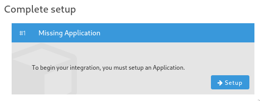
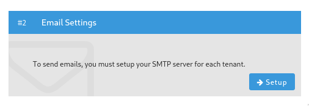
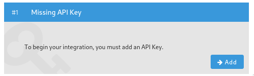

# Getting Started

## Prerequisites

This list may not be complete.

- G++ v?
- JDK8
- Docker
- Docker Compose
- curl
- tar

## Setup

The directory of the `grchive-v2` document will be referenced to as `$GRCHIVE` in this document.
This document will walk you through setting up build environment and the necessary infrastructure to run the GRCHive app on your local machine.

1. Load the developer environment variables into your shell.

    ```
    cp $GRCHIVE/config/dev_env.tmpl $GRCHIVE/config/dev_env
    source $GRCHIVE/config/dev_env
    ```
    
    Ensure your prompt has the `[GRC]` prefix. This script must be sourced before running any command.
1. Download the binaries needed for development.

    ```
    cd $GRCHIVE/deps/binaries
    ./download_all.sh
    ```
1. Add the following paths to your `$PATH`:

    ```
    $GRCHIVE/deps/binaries/bazel/output
    $GRCHIVE/deps/binaries/flyway
    $GRCHIVE/deps/binaries/vault
    ```
1. Create the Docker containers for the backend services:

    ```
    bazel run //devops/database:postgres
    bazel run //devops/vault:vault
    bazel run //devops/fusionauth:fusionauth
    ```
1. Run the Docker containers using Docker compose:

    ```
    cd $GRCHIVE/devops/docker
    docker-compose up
    ```
1. Apply the database migrations:

    ```
    cd $GRCHIVE/devops/database/vault
    ./migrate.sh
    ```
1. Initialize and unseal Vault. Store the unseal key (`$VAULT_UNSEAL_KEY`) and root token (`$VAULT_TOKEN`) in a secure location.

    ```
    vault operator init -address="http://${VAULT_HOST}:8200" -n 1 -t 1
    vault operator unseal -address="http://${VAULT_HOST}:8200"
    ```

    Note that you will need to perform the unseal step every time you bring up the containers using Docker Compose.
1. Configure Vault. These steps must be run every time the `$GRCHIVE/devops/vault/vault_init.sh` file changes.
    ```
    cd $GRCHIVE/devops/vault
    vault login -address="http://${VAULT_HOST}:8200" token=${VAULT_TOKEN}
    ./vault_init.sh
    ```
1. Modify `$GRCHIVE/config/dev_env` and set `VAULT_APPROLE_ROLE_ID` to the output of `vault read -address=http://${VAULT_HOST}:8200 auth/approle/role/webapp/role-id`.
1. Run `vault write -f -address=http://${VAULT_HOST}:8200 auth/approle/role/webapp/secret-id` and in `$GRCHIVE/config/dev_env` set `VAULT_APPROLE_SECRET_ID` to the value corresponding to the `secret_id` key.
1. In your browser, navigate to `${FUSIONAUTH_HOST}:9011` and setup an administrator account.
1. Login and create a new application.

    

    Give the application a reasonable name and under the OAuth tab set:

    * Authorized redirect URLs: `http://localhost:8080/oauth2callback`
    * Authorized request origin URLs:  `http://localhost:8080`
    * Logout URL: `http://localhost:8080/logout`
1. Set `FUSIONAUTH_CLIENT_ID` and `FUSIONAUTH_CLIENT_SECRET` in `$GRCHIVE/config/dev_env` to your application's client ID and client secret respectively.
1. Setup an SMTP server.

    

    Under General, set:
    * Issuer: grchive.com

    Under Email, set:

    * Host: smtp.sendgrid.net
    * Port: 587
    * Security: TLS
    * Username: apikey
    * Password: Sendgrid API key
    * Verify Email: TRUE
    * Verify email when changed: TRUE
    * Verification template: Email Verification
    * Delete unverified users: TRUE
1. Setup a FusionAuth API key.

    

    Copy the key and modify `FUSIONAUTH_API_KEY` in `$GRCHIVE/config/dev_env` to the key value.
    TODO: Determine minimal set of endpoint permissions.
